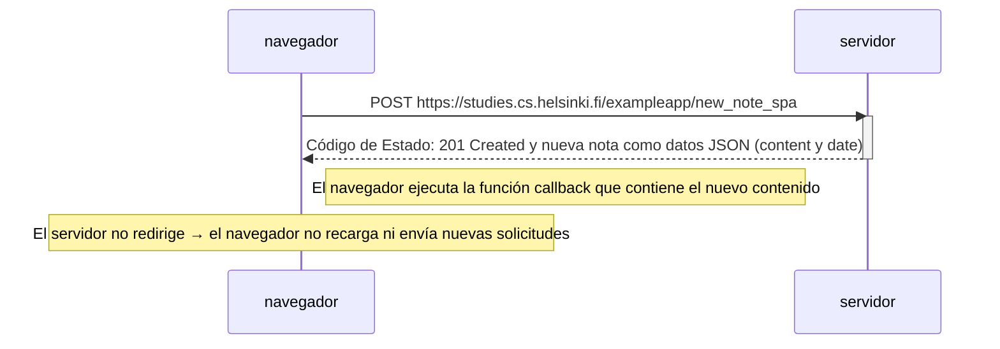

```mermaid
sequenceDiagram
participant navegador
participant servidor

navegador->>servidor: POST https://studies.cs.helsinki.fi/exampleapp/new_note_spa
activate servidor
servidor-->>navegador: Código de Estado: 201 Created y nueva nota como datos JSON (content y date)
deactivate servidor

Note right of navegador: El navegador ejecuta la función callback que contiene el nuevo contenido
Note over navegador: El servidor no redirige → el navegador no recarga ni envía nuevas solicitudes

```
